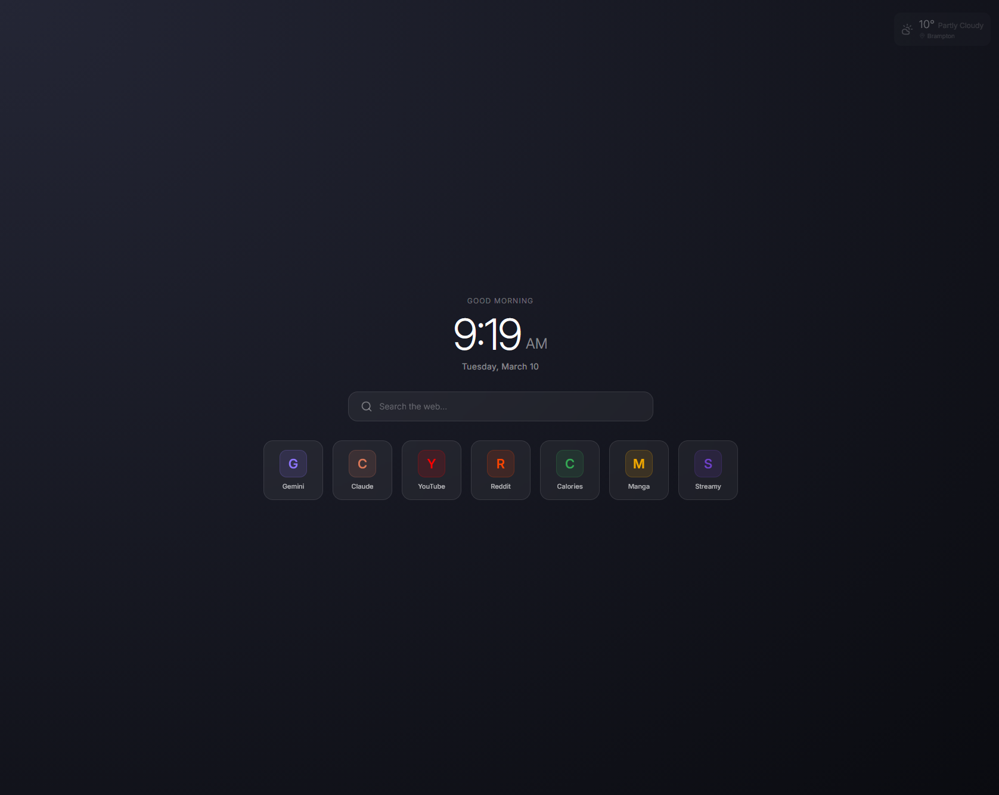

# newTabPlus

A fast, minimal new tab page for Chrome and Firefox. Replaces your default new tab with a glassmorphism dashboard featuring quick-launch tiles, live weather, and full visual customization.



---

## Features

- **Quick-launch tile grid** -- Add, edit, and drag-to-reorder bookmarks as icon tiles
- **Keyboard shortcuts** -- Assign any letter or number key to a tile and press it on the new tab page to go straight there
- **Auto-icons** -- Automatically fetches favicons from any URL; paste a custom image URL to override
- **Live weather widget** -- Always visible in the top-right corner, expands to a 5-day forecast on hover (uses open-meteo, no API key needed)
- **Backgrounds** -- Solid color with animated blobs, CSS gradient, or image URL with blur and darkness controls
- **Shader overlays** -- Aurora (WebGL/THREE.js) or Falling Lines (CSS animation) layered on top of the background
- **10 solid color presets** -- Catppuccin Mocha, Nord, Dracula, Tokyo Night, Gruvbox, and more
- **9 gradient presets** -- Dark Nebula, Cosmic, Northern, Ocean Deep, Purple Haze, and more
- **Tile customization** -- Icon size, column count, and gap sliders
- **Full backup export / import** -- Save and restore your tiles, theme, and layout settings as a single JSON file; selective import lets you choose what to bring in
- **No telemetry, no accounts** -- All data stored locally via `chrome.storage.local`

---

## Installation

### Chrome / Edge (unpacked)

1. Clone or download this repo
2. Install dependencies and build:
   ```bash
   npm install
   npm run build
   ```
3. Open `chrome://extensions`, enable **Developer mode**, click **Load unpacked**, and select this folder

### Firefox

1. Open `about:debugging` then **This Firefox** then **Load Temporary Add-on**
2. Select `manifest.json` from this folder

---

## Usage

- **Add tiles** -- Hover the bottom-right corner to reveal the pencil icon, click it to enter edit mode, then click **+**
- **Edit / delete a tile** -- In edit mode, hover a tile and click the pencil badge
- **Reorder tiles** -- Drag tiles in edit mode
- **Set a shortcut key** -- Open the tile editor and type a letter or number in the Shortcut Key field. Press that key on the new tab page (when the search bar is not focused) to navigate instantly
- **Customize appearance** -- In edit mode, click the settings icon to open the appearance panel
- **Backup and restore** -- In the settings panel under **Links**, export a full backup as `newtab-backup.json` (includes tiles, theme, layout). Import lets you choose which parts to apply
- **Weather** -- Hover the weather widget (top-right) to see a 5-day forecast

---

## Backup Format

Exported backups include all settings. You can edit and re-import them. Structure:

```json
{
  "version": 1,
  "tiles": [
    {
      "name": "GitHub",
      "url": "https://github.com",
      "icon": "",
      "iconUrl": "https://www.google.com/s2/favicons?domain=github.com&sz=64",
      "color": "#6e40c9",
      "shortcut": "g"
    }
  ],
  "settings": {
    "background": { "type": "gradient", "gradient": "..." },
    "shader": { "type": "none" },
    "tiles": { "size": 100, "columns": 7, "gap": 16 }
  }
}
```

---

## Tech Stack

| Layer | Technology |
|---|---|
| UI framework | React 18 |
| Animations | framer-motion |
| Drag and drop | @dnd-kit/core + @dnd-kit/sortable |
| Shader (Aurora) | THREE.js WebGL fragment shader |
| Shader (Falling) | framer-motion CSS gradient animation |
| Styling | Tailwind CSS v3 |
| Bundler | esbuild |
| Weather API | open-meteo (free, no key) |
| Geocoding | Nominatim / OpenStreetMap (free, no key) |
| Storage | chrome.storage.local / browser.storage.local |

---

## Development

```bash
npm install
npm run watch     # esbuild + Tailwind in watch mode
npm run build     # production build to dist/
```

Output goes to `dist/bundle.js` and `dist/style.css`. The extension loads `index.html` as the new tab page.

---

## License

MIT -- see `LICENSE`.
